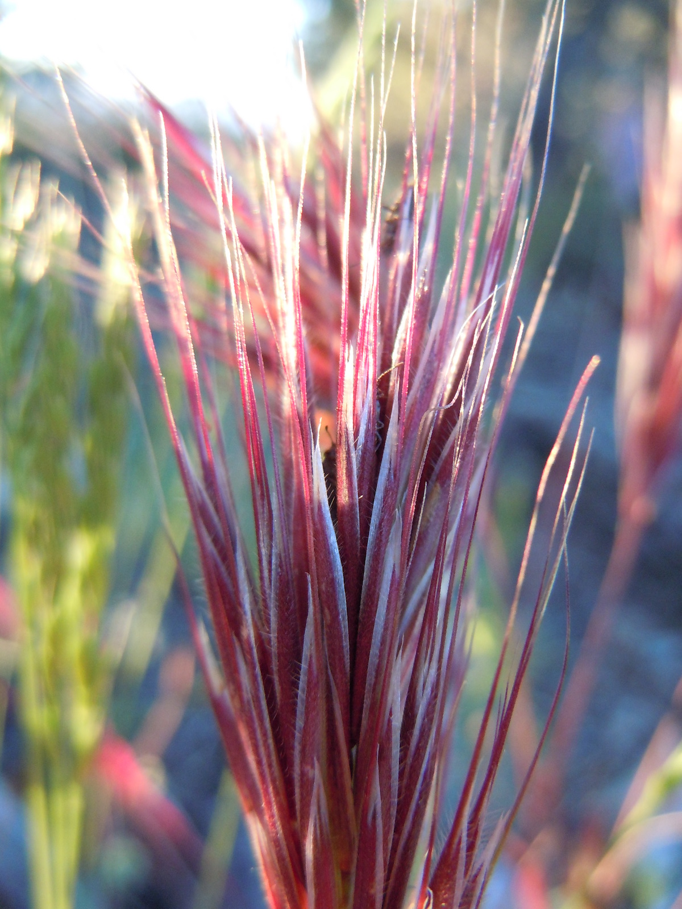

---
title:
author: "cjlortie"
date: "2018"
output:
  html_document:
    theme: lumen
    toc: yes
    toc_depth: 3
    toc_float: yes
  pdf_document:
    toc: yes
---
##Native-brome density water pulsing competition trials  
<br>

###Purpose
To explore the importance of interactions and density in annual plant species in the San Joaquin Desert.


<br>


<br>
[ecoblender](http://ecoblender.org)

###Data
```{r, data, warning=FALSE, message=FALSE}
library(tidyverse)
data <- read_csv("data/data.csv")

#gather up
density <- data %>%
  gather(species, plant.density, 9:12) %>%
  select(census, rep, native.species, native.density, brome.density, water.treatment, species, plant.density) %>%
  mutate(seed.density = case_when(brome.density == 10 ~ 20, brome.density == 0 ~ 10), mixture = case_when(brome.density == 10 ~ "mixture", brome.density == 0 ~ "monoculture"), proportion = case_when(brome.density == 10 ~ plant.density/10*100, brome.density == 0 ~ plant.density/10*100))

#write_csv(density, "data/density.csv")

#density <- density %>%
  #mutate(proportion = plant.density/seed.density*100) need to figure this out

establishment <- density %>%
  filter(census == 2)
  
#established.density <- establishment$plant.density
#need to calculate proportion survival - from those that germinated - ie plant-plant data
final <- density %>%
  filter(census == 3) 
```

###Viz  
```{r, viz, warning=FALSE, message=FALSE}
#density curves
#density dependence is only when curves are non-linear
#brome only
ggplot(density, aes(brome.density, plant.density, color = as.character(census))) +
  geom_smooth(se = FALSE) +
  facet_wrap(~water.treatment*species) +
  labs(color = "census", x = "brome density", y = "native density")

ggplot(density, aes(water.treatment, proportion, color = as.character(census))) +
  geom_smooth(se = FALSE) +
  facet_wrap(~mixture*species) +
  labs(x = "water", y = "proportionate survival", color = "census")


#PLOT ONLY BROME and ONLY NATIVES 

#ggplot(final, aes(seed.density, proportion)) +
  #geom_smooth(se = FALSE) +
  #facet_wrap(~light*brome.treatment*species) +
  #labs(color = "census", x = "seed density", y = "proportionate survival")
#then add contrasts for species
#check performance measures too
```

###Models
Examine differences between species in general.
Formally test for density dependence.
Explore sensitivity of performance measures.


###Interpretations
1. Is there density dependence?
2. Specific specificity
3. Measures
